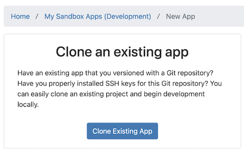

## How to install Open Composer
Open Composer runs on [Open OnDemand](https://openondemand.org/).
Save Open Composer in your Open OnDemand application directory: `/var/www/ood/apps/sys/`.

```
# cd /var/www/ood/apps/sys/
# git clone https://github.com/RIKEN-RCCS/OpenComposer.git
```

## Open Composer configuration
Edit `./OpenComposer/conf.yml.erb`.
All fields except `login_node` and `scheduler` can be omitted.

| Item name | Setting |
| ---- | ---- |
| login_node | Login node when you launch the Open OnDemand web terminal from the history page |
| apps_dir | Application directory |
| history_dir | Directory where submitted job information is stored |
| scheduler | Job scheduler |
| bin_path | PATH of job scheduler commands |
| ssh_wrapper | Commands for using the job scheduler of another node using SSH |
| footer | Text in the footer |
| thumbnail_width | Width of thumbnails for each application on the top page |
| navbar_color | Color of navigation bar |
| dropdown_color | Color of dropdown menu |
| footer_color | Color of footer |
| category_color | Background color of the top page category |
| description_color | Background color of the application description in the application page |
| form_color | Background color of the text area in the application page |

## Registration for Open OnDemand (Administrator)
When you save Open Composer to `/var/www/ood/apps/sys/`, the Open Composer icon will be displayed on the Open OnDemand top page.
If it is not displayed, check `./OpenComposer/manifest.yml`.

You can also display Open Composer applications on the Open OnDemand top page.
For example, if you want to display an application `./OpenComposer/apps/Slurm/`,
create a directory with the same name in the Open OnDemand application directory (`# mkdir /var/www/ood/apps/sys/Slurm`).
Then, create the following Open OnDemand configuration file `manifest.yml` in that directory.

```
# cat /var/www/ood/apps/sys/Slurm/manifest.yml
---
name: Slurm
url: https://example.net/pun/sys/OpenComposer/Slurm
```

## Registration for Open OnDemand (General user)
You can also install Open Composer with general user privileges.
However, the [App Development](https://osc.github.io/ood-documentation/latest/how-tos/app-development/enabling-development-mode.html) feature in Open OnDemand needs to be enabled in advance by an administrator.

Select "My Sandbox Apps (Development)" under "</> Develop" in the navigation bar. (Note that if your web browser window size is small, it will display "</>" instead of "</> Develop".)


Click "New App".


Click "Clone Existing App".



Enter any name in "Directory name" (here we enter OpenComposer), enter "[https://github.com/RIKEN-RCCS/OpenComposer.git](https://github.com/RIKEN-RCCS/OpenComposer.git)" in "Git remote", and click "Submit".


Click "Launch Open Composer".


When you edit `./OpenComposer/manifest.yml`, which is a manifest file for Open OnDemand, the Open Composer icon will appear on the Open OnDemand top page (this icon will only be displayed to the user who installed it).
